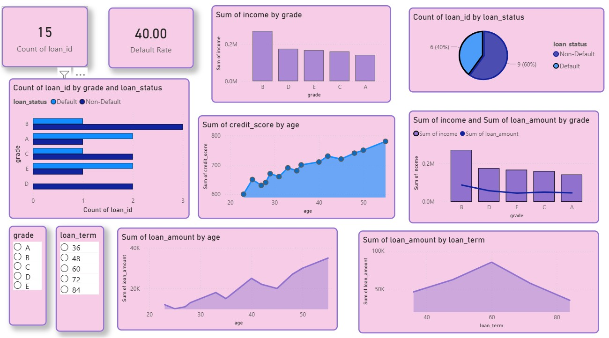

# Banking Risk Analysis

# Project Overview
Performed risk analysis on loan data to identify high-risk customers and understand default patterns. The project helps in improving risk assessment and lending decisions.

# Tools & Technologies
- SQL (Joins, Aggregations, CASE statements)
- Power BI (Data Visualization)
- Excel / CSV

# Dataset
Loan dataset containing customer demographics, income, credit score, loan amount, and loan status.

# Key Analysis
- Loan default rate calculation
- Risk segmentation based on credit score and income
- Loan status distribution (Default vs Non-Default)
- Identification of high-risk customer segments

# Dashboard Features
- KPI Cards (Total Loans, Default Rate)
- Loan Status Distribution (Pie Chart)
- Defaults by Credit Score / Risk Category (Bar Chart)
- Loan Trends Over Time (Line Chart)

# Key Insights
- Customers with lower credit scores had higher default rates
- Higher loan amounts showed increased risk of default
- Certain income groups were more prone to defaults
- Risk segmentation helped identify high-risk customer profiles

# Conclusion
The analysis provides actionable insights for improving loan approval strategies and minimizing financial risk.
## 📊 Dashboard Preview

